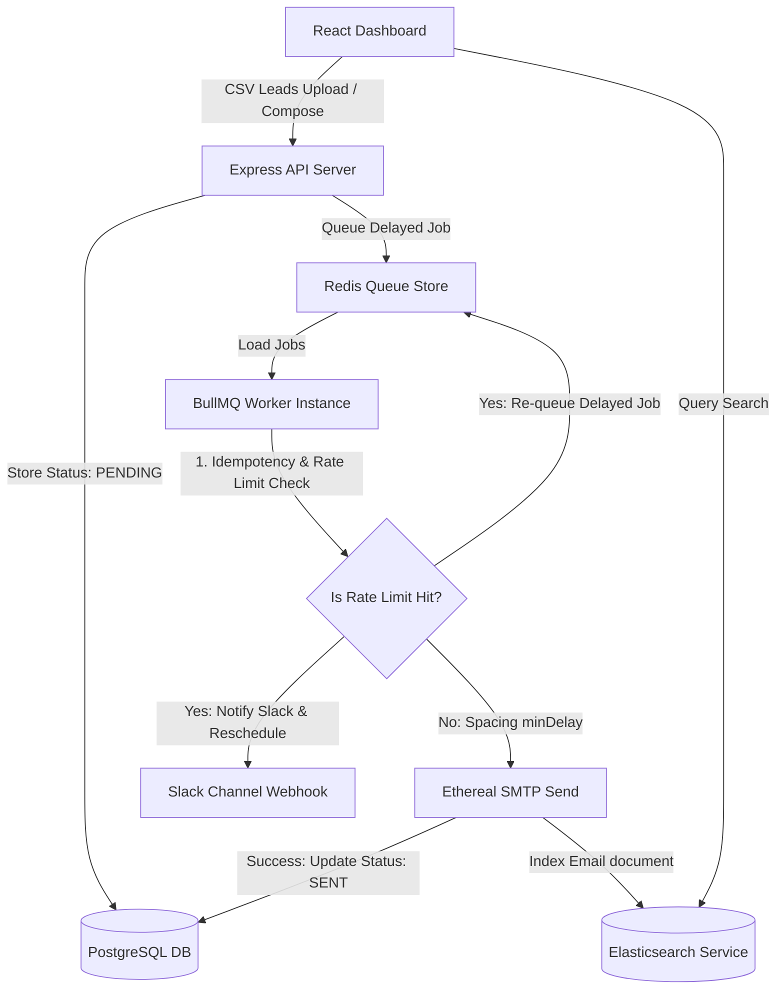

# ReachInbox Full-Stack Email Job Scheduler

A production-grade, highly reliable, and scalable email scheduling service built with a React + TypeScript frontend dashboard and a Node.js + Express + PostgreSQL + Redis + BullMQ backend.

This system supports worker concurrency, delay-spacing between sends, sliding-window hourly rate limiting per sender, real-time BullMQ queue visualization, and Slack webhook alerts on rate limit hits. It utilizes Elasticsearch for fast full-text searching of campaign logs and survives server restarts without duplicate sends.

---

## 🚀 Architecture Overview



### 1. How Scheduling & Spacing Works
When scheduling a campaign of $N$ leads with a starting time ($T_{\text{start}}$), spacing delay ($D$ in seconds), and hourly limit ($L$):
- The campaign is divided into hourly blocks: $\text{HourBlock} = \lfloor i / L \rfloor$ where $i$ is the zero-based index of the recipient.
- Within each block, emails are separated by the spacing delay: $\text{Offset} = (i \pmod L) \times D$.
- The exact execution time for email $i$ is: $t_i = T_{\text{start}} + (\text{HourBlock} \times 3600\text{s}) + \text{Offset}$.
- The backend stores each email in PostgreSQL as `PENDING`, pushes a delayed job to BullMQ with `delay = t_i - Date.now()`, and transitions the email status to `SCHEDULED`.

### 2. Concurrency, Dynamic Rate Limiting & Slack Webhooks
- **Worker Concurrency**: The BullMQ worker is configured with a concurrency parameter (default: 5) to safely process jobs in parallel.
- **Idempotency & Double Sends**: Before sending, the worker performs a check on the email's DB status. If it's already marked as `SENT`, it exits instantly without firing SMTP.
- **Dynamic Limit Evaluation**: In the worker loop, we fetch a Redis counter `ratelimit:<sender>:<hour_timestamp>`. If the incremented value exceeds the hourly limit, the email status shifts to `RATE_LIMITED`.
- **Slack Alerting**: The moment a sender hits their limit, the system looks up their connected Slack credentials in the database and posts an incoming webhook alert mapping the sender and delay timeframe.
- **Rescheduling**: The worker computes the millisecond offset to the start of the next hour, inserts a new delayed BullMQ job, updates the DB record with the new `scheduledAt` and `jobId`, and successfully completes the current job.

### 3. Server Restart Persistence
- Since BullMQ jobs are backed persistently by Redis, and matching email states are stored in PostgreSQL:
  - If the Node.js server shuts down or restarts, no queue state is lost.
  - Active jobs in execution that get interrupted are automatically moved back to the queue (active-to-delayed or retried) by BullMQ.
  - Delayed jobs resume processing at the exact millisecond they were configured for, checking database flags to enforce idempotency.

---

## 🛠 Tech Stack

- **Backend**: Node.js, Express, TypeScript, BullMQ, Redis, PostgreSQL (Prisma ORM), Nodemailer, Elasticsearch, Axios
- **Frontend**: React, TypeScript, Tailwind CSS, Vite, Lucide Icons, Framer Motion, Canvas Confetti

---

## ⚙ Setup & Installation

### Prerequisites
Make sure you have the following installed on your machine:
- [Node.js](https://nodejs.org/) (v16 or higher)
- [Docker](https://www.docker.com/) and Docker Compose

---

### Step 1: Run Infrastructure Services
Start PostgreSQL, Redis, and Elasticsearch using the root `docker-compose.yml`:
```bash
docker-compose up -d
```
This spins up:
- **PostgreSQL** on port `5432`
- **Redis** on port `6379`
- **Elasticsearch** on port `9200` (HTTP, security features disabled for local testing)

---

### Step 2: Set Up the Backend

1. Navigate to the backend directory:
   ```bash
   cd backend
   ```
2. Install dependencies:
   ```bash
   npm install
   ```
3. Set up environment variables. Open the `.env` file and input your Google and Slack OAuth app credentials:
   - To get Google OAuth client details: Go to Google Cloud Console, create a new Project, set up credentials for a Web Application, and add redirect URI: `http://localhost:5000/api/auth/google/callback`.
   - To get Slack OAuth client details: Go to api.slack.com, create a new App, configure an incoming-webhook, and add redirect URI: `http://localhost:5000/api/slack/callback`.
4. Generate the Prisma database client:
   ```bash
   npm run prisma:generate
   ```
5. Apply database schema migrations:
   ```bash
   npm run prisma:migrate
   ```
6. Run the backend development server:
   ```bash
   npm run dev
   ```
   The backend server will start on `http://localhost:5000`. You can monitor BullMQ queues visually via the dashboard at `http://localhost:5000/admin/queues`.

---

### Step 3: Set Up the Frontend

1. Navigate to the frontend directory:
   ```bash
   cd ../frontend
   ```
2. Install dependencies:
   ```bash
   npm install
   ```
3. Start the Vite React development server:
   ```bash
   npm run dev
   ```
   The frontend app will launch at `http://localhost:5173`.

---

## 🧪 Simulation Testing (Behavior Under Load)

We have provided a simulation script that models the scheduling logic for **1,000+ emails** to verify the hourly spreading math:

```bash
# From the backend directory
npm run test-load
```

This script will run independent calculation blocks, demonstrating that:
- Spacing constraints are respected between consecutive rows.
- No single hour block contains more than the hourly limit.
- Order is preserved sequentially.

---

## 📋 Features Checklist

### Backend Requirements
- [x] **Relational DB Storage**: Storing all entities (Users, Emails, Slack Connections) in PostgreSQL via Prisma.
- [x] **BullMQ Delayed Scheduling**: Enforcing scheduling via Redis delayed queue instead of OS cron.
- [x] **Ethereal Fake SMTP Integration**: Automatically generating SMTP sandboxes with preview URLs.
- [x] **Elasticsearch Full-text Search**: Implementing Elasticsearch query search with database fallback.
- [x] **BullMQ Dashboard**: Mounted visually on `/admin/queues` for real-time queue visibility.
- [x] **Worker Concurrency**: Multi-worker concurrency configuration.
- [x] **Min spacing delay**: Queue intervals between individual emails.
- [x] **Hourly limit & Dynamic Rescheduling**: Rescheduling rate-limited emails to the next hour window.
- [x] **Slack Notifications OAuth**: Live real OAuth connection callback exchanging incoming webhooks.

### Frontend Requirements
- [x] **Google Login OAuth**: Complete sign-in redirect flow to secure user profiles.
- [x] **Main Dashboard Layout**: Sidebars, interactive cards, metrics, and search.
- [x] **Compose Modal**: Scheduler input picking start times, delay, limits.
- [x] **CSV Leads drag-and-drop parser**: Client-side regex parser with email validation indicators.
- [x] **Scheduled tab list**: Displays pending queue items and status badges.
- [x] **Sent Archive list**: Displays successfully completed/failed email logs and Ethereal preview buttons.
- [x] **Slack Connector widget**: Connect/Disconnect toggling displaying connected channel names.
